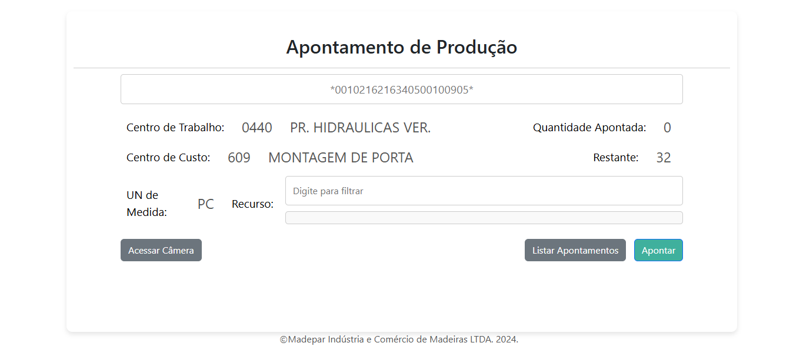
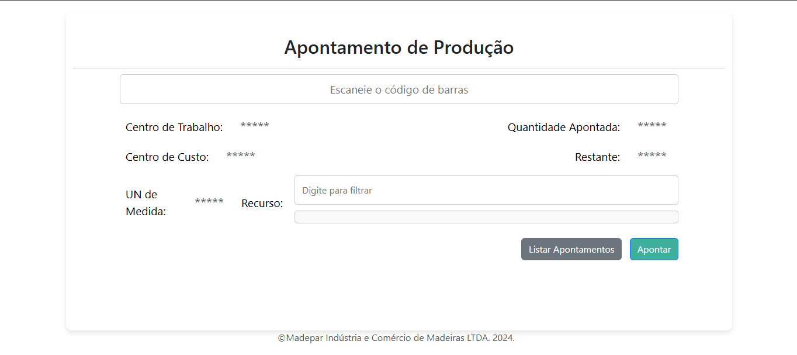
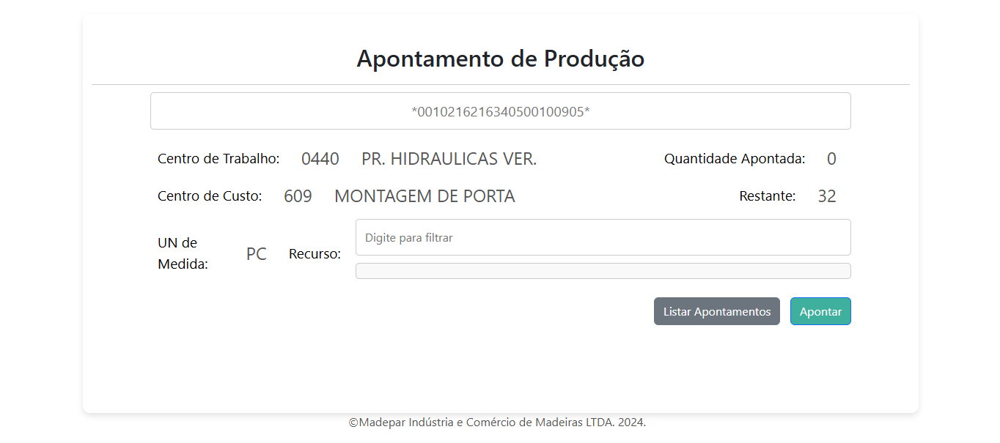
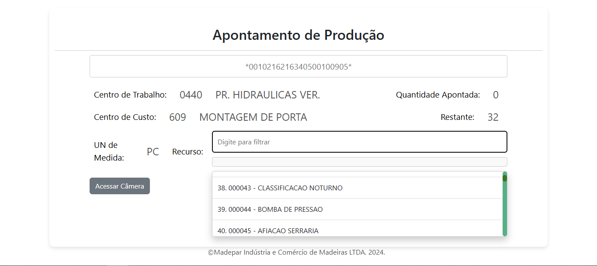

# 📌 Tela de Apontamento de Produção Fabril

## 📋 Descrição
Este projeto é uma aplicação desenvolvida para otimizar o apontamento de produção no ambiente fabril. Desenvolvi essa solução de forma independente para a empresa MadeparDoors, 
localizada em Lages, SC. A MadeparDoors é uma empresa consolidada na região, especializada na produção de portas para o mercado interno e externo, exportando para diversos países.

A solução permite que operadores registrem suas atividades de forma ágil e eficiente, seja através de totens instalados na fábrica ou dispositivos móveis, 
garantindo maior controle e rastreabilidade da produção. No caso específico da Madepar, o sistema foi implementado em ambos os cenários, utilizando tablets Multilaser M10 como dispositivos móveis.

## 🚀 Funcionalidades
- Autenticação: Login de usuários com sessão PHP com verificação via Protheus.
- Leitura de QR Codes para capturar ordem de produção 
- Identificação de operadores via usuários do Protheus.
- Responsividade e compatibilidade, garantindo o uso tanto nos totens da fábrica quanto nos tablets Multilaser M10, que possuem especificações técnicas mais modestas.
- Relatório de últimos apontamentos, exibindo uma lista com as informações dos registros recentes 
- Integração com o sistema Protheus via WebService (captura de usuário e registro de apontamento diretamente no sistema).
- Captura de informações referentes à OP lida com consultas SQL no banco de dados do Protheus 
- Apontamento do lote de produção conforme o recurso que o operador comanda.
- Atualização do DOM com troca de informações entre frontend e backend via AJAX 

- **Consulta de Dados**: Pesquisa informações de produção a partir de códigos de barras.
- **Leitura de QR Code**: Escaneamento via câmera em dispositivos móveis.
- **Registro de Apontamentos**: Envio de dados para um serviço SOAP.
- **Listagem de Apontamentos**: Exibição de histórico em tabela responsiva.
- **Dropdown Personalizado**: Seleção de recursos com filtro dinâmico.
- **Responsividade**: Interface adaptável a desktops e dispositivos móveis.

## 🛠️ Tecnologias Utilizadas
- **Frontend:** HTML, CSS (Bootstrap), JavaScript, Figma
- **Backend:** PHP, WebService usando SOAP
- **Banco de Dados:** MySQL, MSSQL
- **Outras Ferramentas:** XAMPP, Instascan

## 🎨 Propósito
Este projeto hoje faz parte de um projeto maior, onde ele é uma das soluções implementadas dentro de um sistema mais amplo para otimização do ambiente fabril, que tambem esta no meu protifolio.
Este projeto foi minha primeira experiência no desenvolvimento de uma solução real, que está em produção na MadeparDoors. Foi um marco fundamental para minha evolução profissional, 
pois me permitiu aprofundar conhecimentos em diversas tecnologias e aprimorar minha capacidade de desenvolver sistemas funcionais e integrados. 
Além disso, faz parte do meu portfólio, demonstrando minha capacidade de criar soluções eficientes para o ambiente fabril e minha capacidade de resolver problemas de forma independente.

## 🔄 Futuras Melhorias (em desenvolvimento)
- Implementação de apontamento parcial dos lotes (atualmente, o sistema permite apenas apontamento total)
- Inclusão de funcionalidade para registro de horas paradas das máquinas da fábrica
- Migração do projeto para React, preparando o sistema para integração futura em uma plataforma mais ampla

## 📞 Contato
Se tiver alguma dúvida ou quiser saber mais sobre meu trabalho, entre em contato via email: Jesuinodeoliveira97@gmail.com,  ou pelo meu LinkedIn: www.linkedin.com/in/gabriel-j-2157671a1.

---
Feito por Gabriel Jesuino de Oliveira

